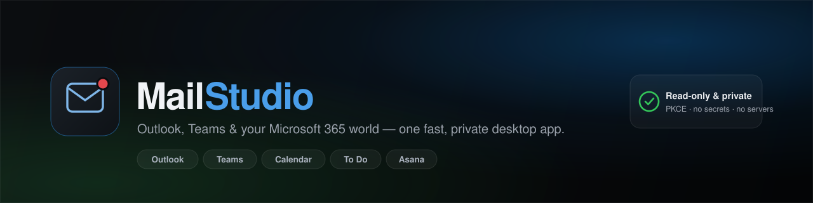
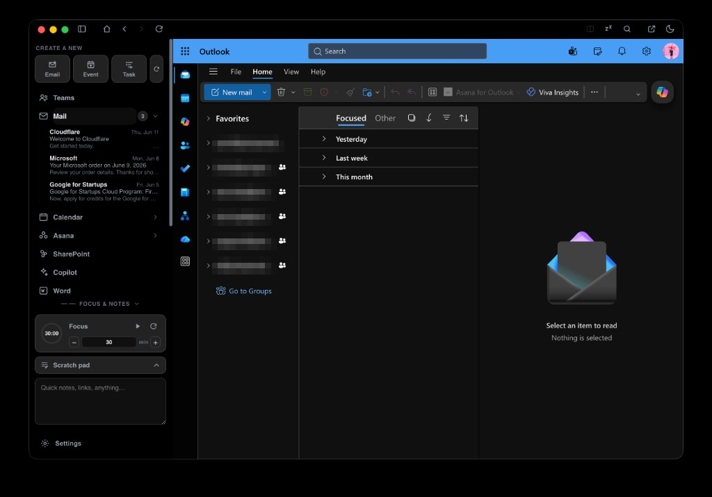
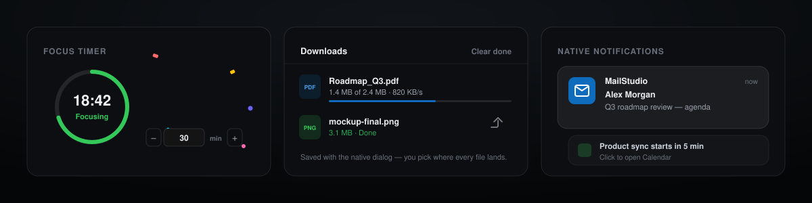

<p align="center">
  
</p>

<p align="center">
  <a href="https://github.com/MailStudio/MailStudio/releases/latest"></a>
  
  
  
  
</p>

<p align="center">
  <b>Outlook, Teams, and your whole Microsoft 365 world — in one fast, private desktop app.</b>
</p>

> Unofficial client. Not affiliated with or endorsed by Microsoft or Asana.
> Outlook and Teams are trademarks of Microsoft Corporation; Asana is a trademark
> of Asana, Inc.

MailStudio keeps Outlook, Teams, Calendar, To Do, the Office suite, and Asana warm
in a single window — with native notifications, smart link routing, and live
sidebar feeds. No browser-tab sprawl. No context switching. One Microsoft sign-in.

<p align="center">
  
</p>

**[⬇ Download the latest release](https://github.com/MailStudio/MailStudio/releases/latest)**

| Platform | File |
|---|---|
| macOS (Apple Silicon) | `MailStudio-1.2.2-arm64.dmg` |
| Windows | `MailStudio-Setup-1.2.2.exe` |
| Linux (AppImage) | `MailStudio-1.2.2.AppImage` |
| Linux (Debian/Ubuntu) | `mailstudio_1.2.2_amd64.deb` |

---

## Why MailStudio

Microsoft's web apps are great. Living in six browser tabs to use them isn't.
MailStudio gives them a real desktop home:

- **One window, one sign-in.** Mail, Teams, Calendar, To Do, Word/Excel/PowerPoint,
  OneDrive, SharePoint, Planner, Copilot, and Asana — all warm, all logged in.
- **Links never escape to the browser.** Click a Teams meeting link in an email or
  an Asana task in a chat and it opens in the tab that owns it, instantly, in-app.
- **Notifications that actually fire.** Native alerts for mail, calendar, Teams, and
  Asana — even when the window is hidden — with quiet hours, batching, and snooze.
- **A sidebar that works for you.** Live unread mail, today's agenda, and assigned
  tasks at a glance, plus a focus timer, scratchpad, and unified downloads.

## What you get

- **Microsoft 365 + Asana in one place** — every surface a click or keystroke away
- **Smart link routing** — Microsoft/Asana links open in their owning tab; only truly external links go to your browser
- **Live sidebar feeds** — unread mail (sender, subject, preview, timestamps), upcoming events, assigned tasks with due dates
- **Real notifications** — Graph + Asana APIs (or a built-in scraper before you connect), with quiet hours, batching, snooze, and click-to-open
- **Split view & resizable sidebar** — two services side by side or stacked; drag the sidebar to any width or collapse it to an icon rail
- **Focus timer + scratchpad** — a configurable Pomodoro (with a celebratory finish) and notes that survive restarts
- **Native downloads** — every file uses the OS Save dialog, with a live progress drawer
- **Custom pinned sites** — add any web app in its own isolated session
- **Desktop-native** — tray menu, Dock badge, keyboard shortcuts, light/dark + macOS Liquid Glass

→ **[Full feature tour](docs/features.md)**

<p align="center">
  
</p>

## Secure & private by design

MailStudio assumes it's wrapping powerful, signed-in accounts — so it's locked down:

- **Read-only access.** Microsoft and Asana connect with least-privilege,
  **read-only** scopes (`Mail.Read`, `Calendars.Read`, Asana `tasks:read`, …). Even
  if a token leaked, it couldn't send, change, or delete anything.
- **No baked-in secrets, no servers.** OAuth uses PKCE; Microsoft needs no client
  secret at all, and Asana's required client secret is **yours** (from your own app
  registration) — nothing is shipped in the repo. There's **no telemetry and no
  third-party backend.** Your data flows only between your machine and Microsoft / Asana.
- **Encrypted credentials.** Tokens and the Asana client secret are sealed in your
  OS keychain via Electron `safeStorage`, never written in plaintext.
- **Hard session isolation.** Custom pinned sites each run in their own partition
  and can't touch your Microsoft or Asana cookies, storage, or tokens.
- **Sandboxed web views.** `contextIsolation`, `sandbox`, no Node integration, a
  domain allowlist, blocked `file://`/`javascript:` navigation, and a native
  confirmation before any cross-app link opens into Teams.

→ **[Security model & privacy details](docs/security.md)** · [Report a vulnerability](SECURITY.md)

## Get connected

MailStudio ships with **no API keys** — you bring your own free OAuth app
registrations (about 5 minutes each, read-only). Until you connect, a built-in
scraper drives the feeds; once connected, the official APIs take over.

→ **[Step-by-step setup for Microsoft & Asana](docs/setup.md)**

## Build it yourself

```bash
npm install
npm start          # run in development
npm run check      # syntax-check every source file
npm test           # unit tests
npm run dist:mac   # build a macOS .dmg + .zip
```

→ **[Builds, packaging, auto-update & project layout](docs/development.md)**

## Status

MailStudio is in **beta** — used daily, with rough edges. Microsoft/Asana UI changes
can disrupt the scraper fallback (the API paths are immune), and macOS notarization
is still on the roadmap. Issues and ideas are genuinely welcome.

## Acknowledgements

Built with the help of [Claude Code](https://claude.com/claude-code) — thank you, Anthropic.

## License

MIT
